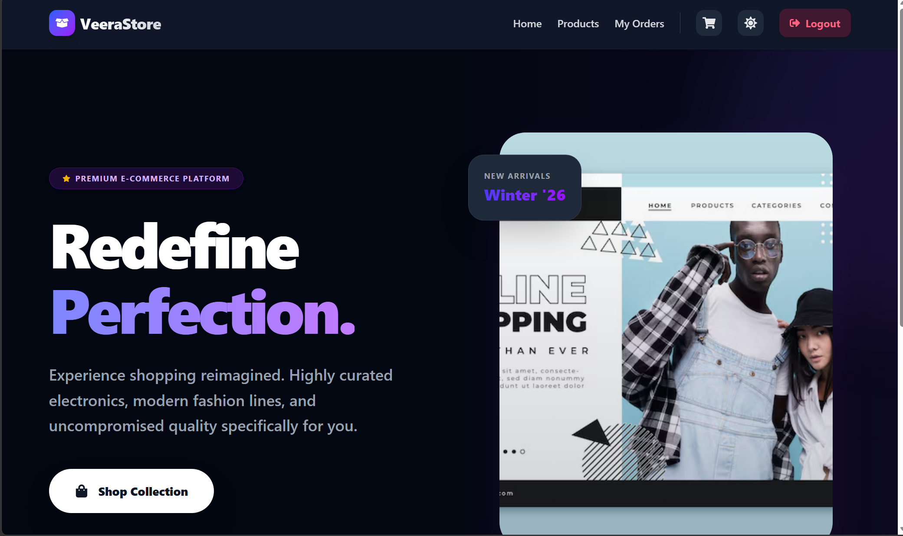
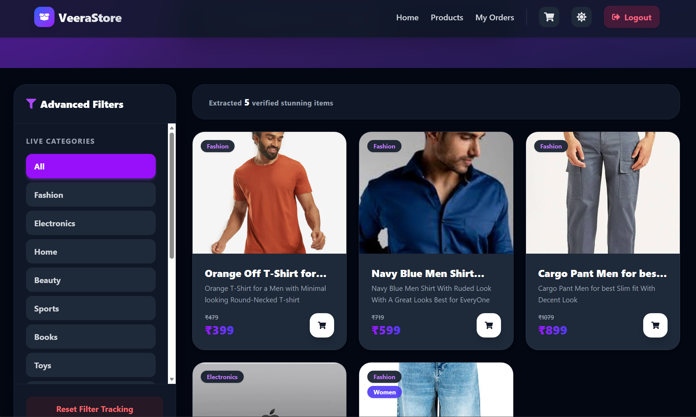
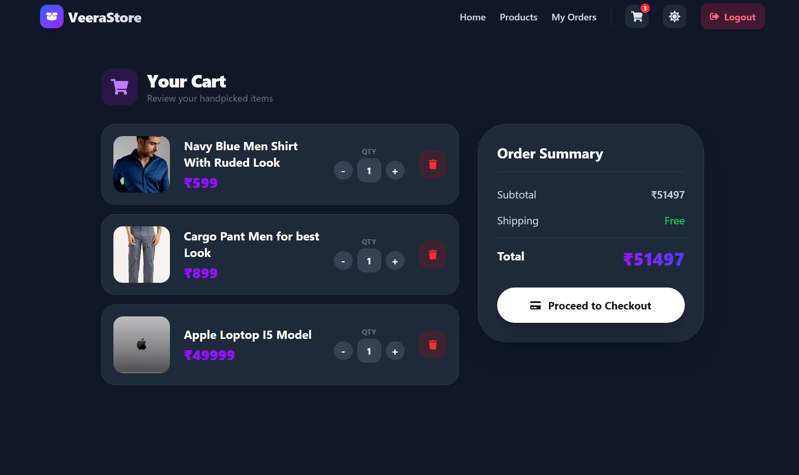
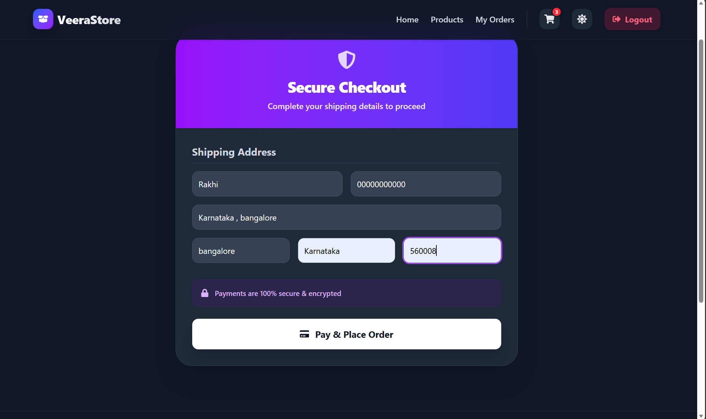

# Full-Stack MERN E-Commerce Website

A modern, fully functional E-Commerce web application built using the **MERN** stack (**M**ongoDB, **E**xpress.js, **R**eact, **N**ode.js). This project provides a seamless shopping experience with features like user authentication, product browsing, dynamic cart management, and secure payment integration.

## 🚀 Features

- **User Authentication:** Secure login and registration using JWT and bcrypt.
- **Product Management:** Browse products, view details, and filter options.
- **Shopping Cart:** Add, remove, and manage quantities of items in the cart.
- **Secure Online Payments:** Integrated with Razorpay for seamless and secure checkout.
- **Cloud Storage:** Image uploads handled via Cloudinary.
- **Responsive Design:** Optimized for all devices using Tailwind CSS.
- **Smooth Animations:** UI interactions enhanced with Framer Motion.

---

## 📸 Screenshots

*(Replace the placeholder URLs with the actual image links of your project after uploading them to GitHub or an image hosting service.)*

### 🏠 Homepage


### 🛍️ Products Page


### 🛒 Cart Page


### 💳 Payment Page


---

## 🛠️ Tech Stack

### Frontend
- **React.js (v19)** with **Vite**
- **Tailwind CSS** for responsive styling
- **React Router** for seamless navigation
- **Framer Motion** for smooth UI animations
- **Axios** for API requests
- **React Toastify** for attractive notifications

### Backend
- **Node.js** & **Express.js** for the server framework
- **MongoDB** & **Mongoose** for the database
- **JSON Web Token (JWT)** & **Bcrypt** for authentication
- **Razorpay** for payment gateway integration
- **Multer** & **Cloudinary** for handling media uploads

---

## ⚙️ Local Development Setup

To run this project locally, follow the steps below:

### Prerequisites:
- Node.js installed on your machine.
- MongoDB Atlas account (or local MongoDB).
- Razorpay account (for payment API keys).
- Cloudinary account (for image upload API keys).

### 1. Clone the repository
```bash
git clone https://github.com/Cveerababu15/Ecommerce_Website.git
cd Ecommerce_Website
```

### 2. Backend Setup
```bash
cd backend
npm install
```

Create a `.env` file inside the `backend` directory and add your environment variables:
```env
PORT=5000
MONGODB_URI=your_mongodb_connection_string
JWT_SECRET=your_jwt_secret_key
RAZORPAY_KEY_ID=your_razorpay_key_id
RAZORPAY_KEY_SECRET=your_razorpay_key_secret
CLOUDINARY_CLOUD_NAME=your_cloudinary_name
CLOUDINARY_API_KEY=your_cloudinary_api_key
CLOUDINARY_API_SECRET=your_cloudinary_api_secret
```

Start the backend server:
```bash
npm run dev
```

### 3. Frontend Setup
Open a new terminal window inside the root directory.
```bash
cd frontend
npm install
```

Start the Vite development server:
```bash
npm run dev
```

### 4. Open in Browser
Visit `http://localhost:5173` to explore your application.

---

## 🤝 Contributing
Contributions, issues, and feature requests are welcome!

## 📜 License
This project is open-source.
